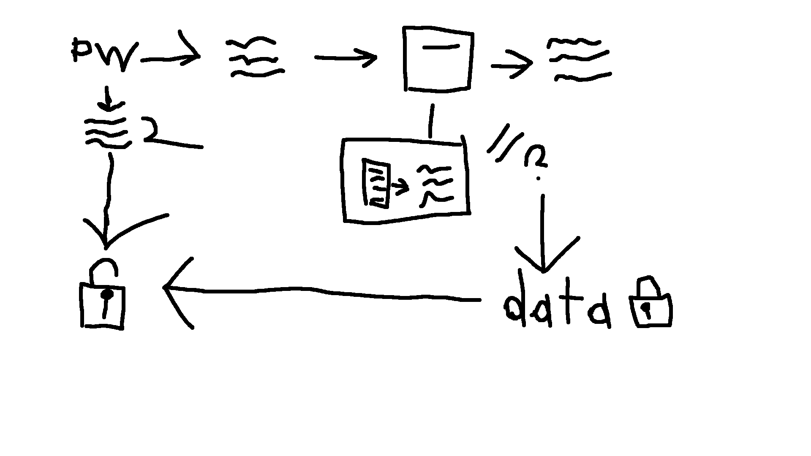

# Counts
Webapp to count things.

## Security / Privacy
User passwords are hashed with SHA512 twice. Once on the client and then again on the server.
After providing correct credentials, the user is given a session ID which is stored as a cookie. The session ID expires after a day.
The counter data is encrypted and decrypted on the client using the password with the prefix "transrights<3_" put through SHA512 as a key.
The encryption key is only ever stored on the client in localstorage.

All counters have a visibility type. They can currently be one of the following:
- "PRIVATE": Counter data is encrypted. Only the owner can view or modify it.
- "PROTECTED": The counter data is not encrypted. Everyone can view it. Only the owner can write to it.
- "PUBLIC": The counter data is not encrypted. Everyone can view it and write to it.
The visibility may be changed by the owner at any point. Unencrypted data will become encrypted and vice versa.
Unencrypted data is never kept on record on the main site, but you can never know about other people using the internet.

Counter data encryption:
Sensitive strings in Counter data are encrypted with aes-js via the following method:
1. Split the 512-bit key into a left and right half.
2. Encrypt the string with an AES Counter set to 1 and the left half of the key.
3. Encrypt the result of `2.` with another AES Counter set to 2 and the right half of the key.
For the decryption the same thing is done but like backwards. Make sure to use fresh counters so the value is 1.